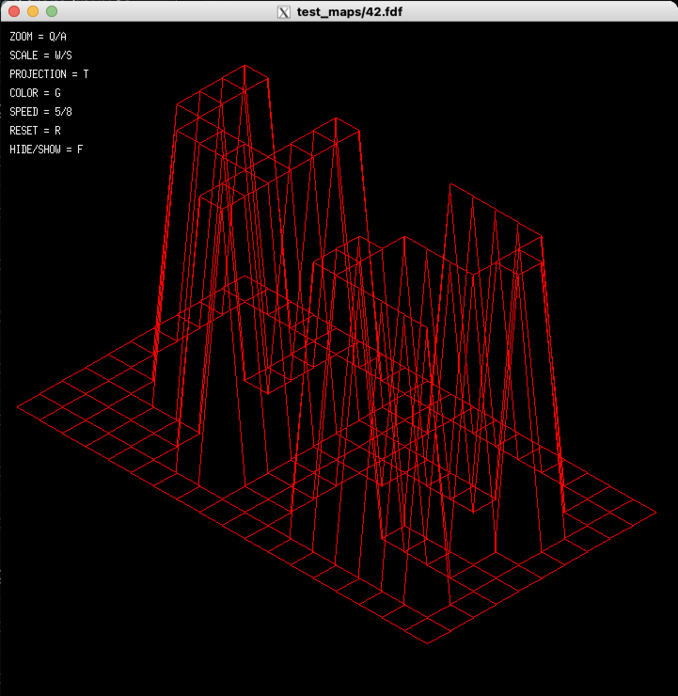

# fdf
Hive Helsinki project fdf. The idea of the project is to create a program which reads a simple height map and creates a window which has the map shown as a wireframe. MinilibX graphics library used.

